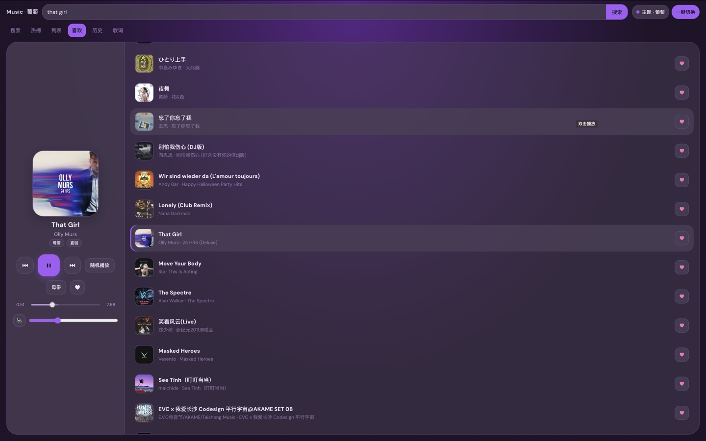
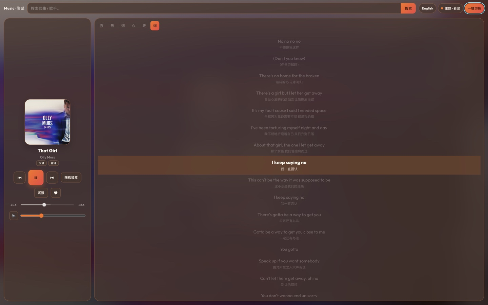
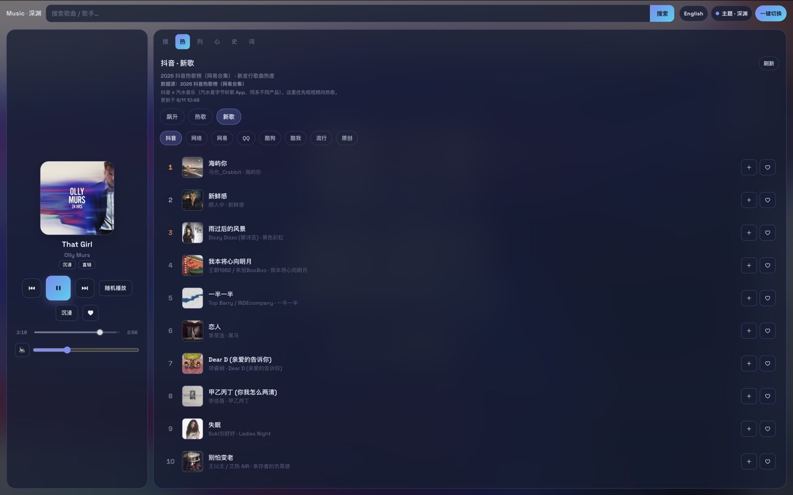

# music-du

Open-source **personal music web app** — search, charts, favorites, lyrics, many skins.

**Stack:** TypeScript · [Hono](https://hono.dev) BFF · React + Zustand · **Cloudflare Workers + D1** or **Node + SQLite** (VPS / Fly / Docker).

> **Self-hosting?** Deploy the **normal writable app** (`npm run deploy:cf` / Node / Fly).  
> **Demo / read-only** is optional showcase only — see [below](#optional-read-only-demo). You do **not** need it for your own site.

```text
Browser SPA  ──same-origin /api/*──►  Worker or Node BFF
                                       ├─ your music gateway (env)
                                       ├─ library (D1 or SQLite)
                                       └─ charts · covers · lyrics
```

---

## Screenshots

Top-right **主题 / 一键切换** cycles skins. Desktop uses a side player + list.

| 喜欢 · 葡萄 | 歌词 · 密林 | 热榜 · 墨红花 |
|:---:|:---:|:---:|
|  |  |  |

---

## Features

- **Play** — direct CDN URL, list / single / shuffle, Media Session, quality pick  
- **Library** — playlist · favorites · history · multi-device `revision` lock  
- **Discover** — keyword search · multi-platform charts (soar / hot / new)  
- **Lyrics** — multi-source resolve + local cache + follow scroll  
- **Skins** — many themes × side / immersive / compact layouts  
- **Import / export** — `/favs` JSON, `/import` (id or name list)  
- **Shortcuts** — `Space` play/pause · `N` / `P` next/prev · more in-app  

Details: [docs/FEATURES.md](./docs/FEATURES.md) · [docs/ARCHITECTURE.md](./docs/ARCHITECTURE.md)

---

## Requirements

- **Node.js ≥ 20**
- Optional: Cloudflare account + [Wrangler](https://developers.cloudflare.com/workers/wrangler/) for Workers  
- A music **gateway you are allowed to use** (see disclaimer)

---

## Quick start (local)

```bash
git clone https://github.com/sonnemusk/music-du.git
cd music-du
cp .env.example .env
# Edit .env — gateway base URL / keys (server-only). See .env.example comments.

npm ci
npm run dev          # http://127.0.0.1:8787
```

```bash
npm test && npm run typecheck
npm run build && npm run start:prod
```

---

## Deploy (your site — default)

Full guide: **[docs/DEPLOY.md](./docs/DEPLOY.md)** (Cloudflare · VPS · Fly · Docker · Vercel notes).

| Target | One-liner |
|--------|-----------|
| **Cloudflare** | `npm run setup:d1` → secrets → **`npm run deploy:cf`** |
| **Node VPS** | `npm run build && HOST=0.0.0.0 node dist/server/node.js` |
| **Fly.io** | `fly launch` + volume + secrets → `fly deploy` |
| **Vercel** | Not a full-stack drop-in — SPA only or API elsewhere ([why](./docs/DEPLOY.md#4-vercel)) |
| **Demo read-only** | Optional: `npm run deploy:cf:demo` — **not** for normal self-host |

### Cloudflare (most common)

```bash
npm run setup:d1                              # paste database_id into wrangler.toml
npx wrangler secret put MUSIC_ACCESS_TOKEN    # recommended for private installs
npx wrangler secret put CHKSZ_FALLBACK_APIKEYS  # if your backup gateway needs keys
npm run deploy:cf                             # writable install — not demo
```

Bind a custom domain in the Cloudflare dashboard. Optional: [Access](./docs/ACCESS.md).

### Node / Docker

```bash
# bare metal
npm ci && npm run build
HOST=0.0.0.0 PORT=8787 NODE_ENV=production node dist/server/node.js

# Docker
docker build -t music-du .
docker run -d -p 8787:8787 -v music-data:/data \
  -e MUSIC_ACCESS_TOKEN=… -e CHKSZ_FALLBACK_APIKEYS=… music-du
```

Persist `MUSIC_DATA_DIR` / the volume (SQLite + caches).

---

## Environment

Copy [`.env.example`](./.env.example). **Never commit** `.env`, `.dev.vars`, or `data/*`.

| Variable | Where | Purpose |
|----------|--------|---------|
| `CHKSZ_API_BASE` | Server | Primary music gateway base URL |
| `CHKSZ_FALLBACK_BASE` / `CHKSZ_FALLBACK_APIKEYS` | Server | Backup host + keys (**never** in the browser) |
| `MUSIC_ACCESS_TOKEN` | Server | Protects `/api/library` when set |
| `VITE_MUSIC_ACCESS_TOKEN` | Build (optional) | SPA default token — avoid on public demos |
| `LIBRARY_READONLY` | Worker **demo only** | Leave **unset** for your site |
| `LIBRARY_TOKEN_REQUIRED_HOSTS` | Worker | Hosts that must have library token set |
| `HOST` / `PORT` / `MUSIC_DATA_DIR` | Node | Listen address + SQLite directory |

---

## Documentation

| Doc | Contents |
|-----|----------|
| **[docs/DEPLOY.md](./docs/DEPLOY.md)** | Step-by-step: CF · VPS · Fly · Docker · Vercel |
| **[docs/API.md](./docs/API.md)** | Full HTTP API |
| **[docs/MUSIC-PROVIDERS.md](./docs/MUSIC-PROVIDERS.md)** | Music APIs, copyright, plug-in guide |
| **[docs/ACCESS.md](./docs/ACCESS.md)** | Cloudflare Access + library token |
| **[docs/ARCHITECTURE.md](./docs/ARCHITECTURE.md)** | Runtime design |
| **[SECURITY.md](./SECURITY.md)** | Secrets & reporting |

**Agents:** [docs/DEPLOY.md §8](./docs/DEPLOY.md) checklist → then [docs/API.md](./docs/API.md). Deploy the **writable** app unless the user asked for a read-only gallery.

---

## Scripts

| Script | Purpose |
|--------|---------|
| `npm run dev` | Local Hono + Vite |
| `npm run build` | `dist/client` + `dist/server` |
| `npm run start:prod` | Node production (**your** site) |
| `npm test` / `typecheck` | Vitest / TypeScript |
| `npm run smoke` | HTTP smoke against a running server |
| `npm run setup:d1` | Create free D1 |
| `npm run deploy:cf` | **Default** CF deploy (writable) |
| `npm run deploy:cf:demo` | Optional read-only second Worker |

---

## Project layout

```text
client/       React SPA (Vite)
server/       Hono BFF — node.ts · worker.ts
docs/         Deploy, API, providers, screenshots
migrations/   D1 SQL
scripts/      smoke, D1 setup
tests/        Vitest
data/         Runtime only (gitignored)
```

---

## HTTP API (index)

| Method | Path | Notes |
|--------|------|--------|
| GET | `/api/health` | Flags, `readOnly` |
| GET | `/api/search` | `?q=` |
| GET | `/api/charts` · `/api/charts/:platform` | soar / hot / new |
| GET | `/api/song/:sid` | Resolve stream URL |
| GET | `/api/song/:sid/qualities` | Quality ladder |
| GET | `/api/stream/:sid` | CF: **302** to CDN |
| GET | `/api/lyric/:sid` | Lyrics |
| GET | `/api/cover-proxy` | Cover proxy |
| GET/PUT | `/api/library` | Token when configured |
| DELETE | `/api/library/:listType/:sid` | playlist / favorites / history |
| GET | `/favs` · `/export` | Favorites JSON |
| GET/POST | `/import` | Merge by id or name list |

Full reference: **[docs/API.md](./docs/API.md)**.

---

## Optional: read-only demo

Ignore this if you only want **your own** music site.

For a **second** public “listen only” Worker (no edit favorites / no export):

```bash
npm run deploy:cf:demo    # wrangler --env demo
```

```toml
# [env.demo] only — never on the default Worker
LIBRARY_READONLY = "true"
```

| | Your site (default) | Demo (optional) |
|--|--|--|
| Command | `deploy:cf` / Node / Fly | `deploy:cf:demo` only |
| Library | Read **and write** | Read-only |
| `LIBRARY_READONLY` | Unset | `true` |

---

## Disclaimer

This repo is a **player + BFF**. It does **not** ship a licensed music catalog.

- You must use a **lawful** API / content source.  
- Default env may point at a community NetEase-compatible gateway for convenience; **availability and legality are yours**.  
- How to plug in your own API: **[docs/MUSIC-PROVIDERS.md](./docs/MUSIC-PROVIDERS.md)**.

---

## Contributing

- Keep gateway keys **server-side** only  
- `npm test && npm run typecheck` before PR  
- Do not commit `.env`, personal libraries, or real secrets  

---

## License

[MIT](./LICENSE)
