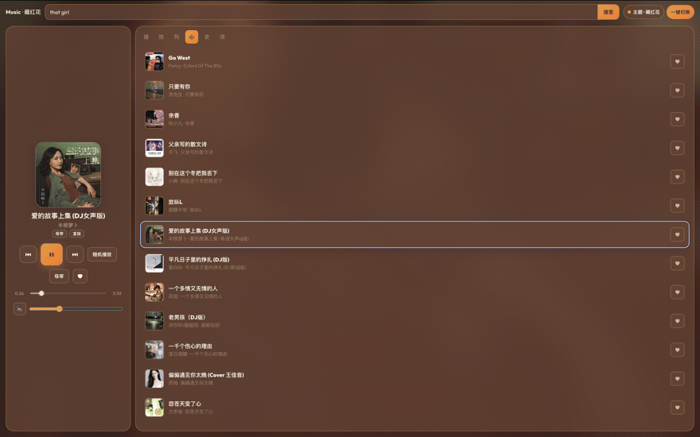
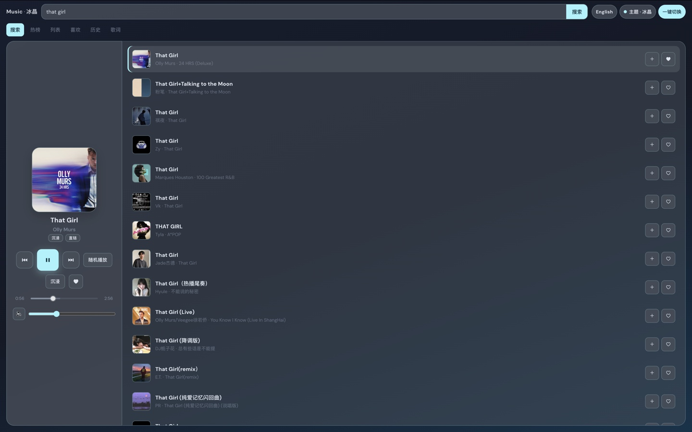

# music-du

[English](./README.md) · [简体中文](./README.zh-CN.md)

[](https://github.com/sonnemusk/music-du/actions/workflows/ci.yml)
[](./LICENSE)
[](https://nodejs.org/)

开源的**个人音乐 Web 应用** — 搜索、榜单、收藏、歌词、多套皮肤。

TypeScript · [Hono](https://hono.dev) · React + Zustand · **Cloudflare Workers + D1** 或 **Node + SQLite**。

| | |
|--|--|
| **Demo（只读）** | https://music.du.dev |
| **自建** | 可读写完整站 — 见[快速开始](#快速开始) |

```text
SPA ── /api/* ──► Worker / Node ──► 音乐网关 + 曲库（D1 或 SQLite）
```

---

## 截图

右上角可切换 **语言**（中文 / English）和 **主题**（主题 · 一键切换）。

<p align="center">
  <br/>
  <em>一键换肤</em>
</p>

<p align="center">
  <br/>
  <em>搜索</em>
</p>

<p align="center">
  <br/>
  <em>喜欢 · 收藏 + 播放器</em>
</p>

<p align="center">
  <br/>
  <em>歌词 · 中英跟滚</em>
</p>

<p align="center">
  <br/>
  <em>热榜 · 多平台榜单</em>
</p>

---

## 功能

- 播放 — CDN 直链、随机/循环、音质、Media Session  
- 曲库 — 列表、喜欢、历史、多端同步  
- 搜索与榜单 — 飙升 / 热歌 / 新歌  
- 歌词 — 多源、缓存、跟滚  
- 皮肤 — 多主题 × 侧栏 / 沉浸 / 紧凑  
- 导入导出 — `/favs`、`/import`  
- 默认**中文**，顶栏可切 **English**  
- 快捷键 — `空格`、`N` / `P` …

---

## 快速开始

```bash
git clone https://github.com/sonnemusk/music-du.git && cd music-du
cp .env.example .env    # 网关地址 / 密钥，仅服务端
npm ci && npm run dev   # http://127.0.0.1:8787
```

需要 Node **≥ 20**。测试：`npm test && npm run typecheck`。

---

## 部署

自建默认是**可写正式站**，不必部署 Demo Worker。

| | |
|--|--|
| **Cloudflare** | `npm run setup:d1` → secrets → `npm run deploy:cf` |
| **Node** | `npm run build && HOST=0.0.0.0 node dist/server/node.js` |
| **Fly / Docker** | [fly.toml](./fly.toml) · [Dockerfile](./Dockerfile) |
| **详情** | **[docs/DEPLOY.md](./docs/DEPLOY.md)** |

```bash
# Cloudflare（最常用）
npm run setup:d1
npx wrangler secret put MUSIC_ACCESS_TOKEN       # 私人曲库建议配置
npx wrangler secret put CHKSZ_FALLBACK_APIKEYS   # 备用网关需要时
npm run deploy:cf
```

---

## 环境变量

[`.env.example`](./.env.example) — 勿提交密钥或 `data/*`。

| 变量 | 作用 |
|------|------|
| `CHKSZ_API_BASE` / `CHKSZ_FALLBACK_*` | 音乐网关（仅服务端） |
| `MUSIC_ACCESS_TOKEN` | 保护曲库 API |
| `LIBRARY_READONLY` | 仅 Demo — 自建不要设 |
| `HOST` / `PORT` / `MUSIC_DATA_DIR` | Node |

---

## 文档与 API

| | |
|--|--|
| [docs/DEPLOY.md](./docs/DEPLOY.md) | 部署说明 |
| [docs/API.md](./docs/API.md) | HTTP API |
| [docs/MUSIC-PROVIDERS.md](./docs/MUSIC-PROVIDERS.md) | 音乐 API 与版权 |
| [docs/ARCHITECTURE.md](./docs/ARCHITECTURE.md) | 架构 |
| [SECURITY.md](./SECURITY.md) · [CONTRIBUTING.md](./CONTRIBUTING.md) | |

```
GET  /api/health  /api/search  /api/charts/:platform
GET  /api/song/:id  /api/stream/:id  /api/lyric/:id
GET|PUT  /api/library    DELETE /api/library/:list/:id
GET  /favs    GET|POST /import
```

技术细节以英文 `docs/*.md` 为准（命令通用）。

---

## 可选：只读 Demo

需要第二个「只能听」的公网站点时（类似 https://music.du.dev）：

```bash
npm run deploy:cf:demo   # 不是自建默认路径
```

---

## 免责声明

本项目是播放器 + BFF，**不含**正版曲库。须使用合法音乐 API。  
见 [docs/MUSIC-PROVIDERS.md](./docs/MUSIC-PROVIDERS.md)。

## 许可证

[MIT](./LICENSE)
